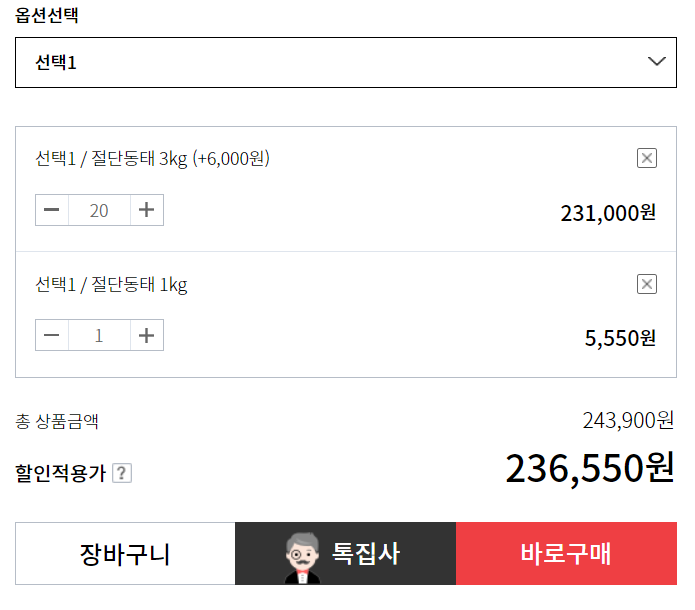

# API란

 ## API란?

"API(Application Programming Interface, 응용 프로그램 프로그래밍 인터페이스)는 응용 프로그램에서 사용할 수 있도록, 운영 체제나 프로그래밍 언어가 제공하는 기능을 제어할 수 있게 만든 인터페이스를 뜻한다. 주로 파일 제어, 창 제어, 화상 처리, 문자 제어 등을 위한 인터페이스를 제공한다." - 위키백과

 

결론부터 말하자면,

API란 운용체제나 라이브러리, DB 관리 시스템 등에서 사용자에게 자신을 쉽게 사용할 수 있도록 제공하는 시스템 혹은 규격을 의미합니다.

 

만약 요리사가 재료를 주문하려고 때,

주문란이 아무런 설명도 없는 공백상태라면 매우 당혹스러울 것입니다.

하지만 실제로는 재료명 콤보박스와 수량 칸, 배송형태, 주소칸 등이 있기때문에 우리는 냉동식품의 보관을 어떻게 설명해야하는지 오는 길은 어떻게 설명해야하는지 고민할 필요가 없습니다.

 

API는 바로 이러한 규격화된 주문서의 역할을 한다고 볼 수 있습니다.

앞으로 우리가 개발을 하게되면 어느순간 특정 기능을 지원하는 프로그램이 필요할 때가 올것입니다.

그때 우리는 그 프로그램이 어떻게 동작하는지 원리까지 알 필요가 없습니다.

다만 주문란에 동태, 냉동, 20마리를 체크하고 주소를 입력하면 냉동포장된 20마리의 동태가 해당 주소로 오는것 처럼

해당 프로그램이 제공한 API를 잘 따른다면 원하는 데이터를 얻을 수 있을 것입니다.

 

## API의 종류

 

API는 접근 권한과 용도에 따라 Open API와 Private API로 나눌 수 있습니다.

 

-Open API

 

Open API는 원한다면 누구든지 접근할 수 있도록 설계된 인터페이스입니다.

예를 들어 기상청에서는 날씨에 대한 정보를 신청만하면 누구나 쓸 수 있도록 개방해 놓았습니다.

기상자료개방포털에서 데이터-오픈 API로 들어가면 기상청이 제공하는 Open_API목록을 조회할 수 있습니다. 

 

 

그렇다면 왜 열심히 만든 자신의 프로그램과 자료를 오픈하는 것일까요?

이유는 Open API를 이용하는 다양한 기업들과 확장서비스들이 늘어나면서 자사의 경쟁력이 강화될수 있기 때문입니다.

예를 들어 '네이버 아이디로 로그인 API'를 이용하는 기업들이 늘어날수록 네이버가입자들이 네이버를 탈퇴할때의 기회비용이 커지는 효과를 얻을 수 있습니다.

 

-Private API

 

Private API는 권한을 가진 일부 사람들만(예를들면 내부 개발자들) 접근할 수 있도록 설계된 인터페이스 입니다.

예를 들어 조직 내에서 작업하는 개발자만 사용할 수 있도록 데이터 및 프로그램 기능의 일부를 열수 있습니다.

이때, 개발자가 만든 응용프로그램은 오픈되어 배포하기도 하지만, Private API는 외부 사람들에게는 제공되지 않습니다.

 

Private API의 장점은 내부개발자에게만 데이터와 인터페이스가 노출되기 때문에 보안의 위험이 감소합니다.

그리고 기업내부에서 통합된 API를 사용함으로써 사용내역을 통해 업무분석이 가능합니다.

 

## 마무리

 

프로그래밍을 공부하면서 이곳저곳에서 보이던 API라는 용어에 대해 대략적으로만 이해하고 있었는데,

이번에 간략하게나마 정리할 수 있어서 좋았습니다.

앞으로 개발을 하면서 API를 사용하는 기회가 온다면 그때 사용방법에 대한 글도 다시 작성하면 좋을 것 같습니다.